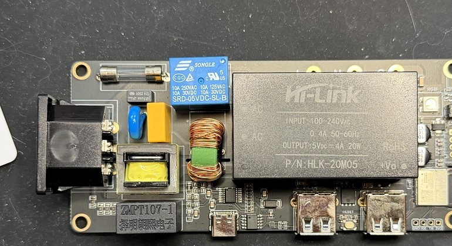
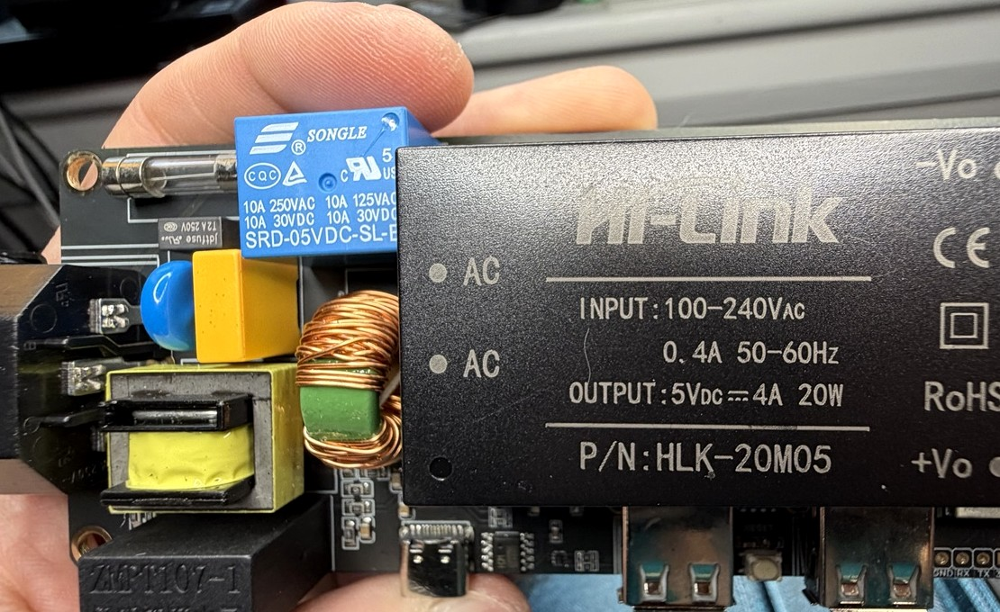
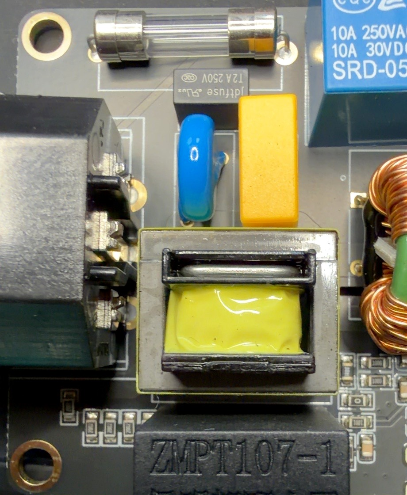

# BIGTREETECH Panda PWR teardown characterization

> **EXTERNAL REFERENCE HARDWARE / NOT A JUMPJET DESIGN SOURCE.** This record
> documents a third-party product for architecture review only. It is not a
> JumpJet BOM source, does not select any JumpJet component, does not authorize
> copying the Panda PWR design, and does not establish safety compliance for any
> product.

> [!WARNING]
> **Mains hazard.** The Panda PWR is a mains-powered device. Destructive
> teardown removes the original enclosure and its touch protection. Any
> measurement on an exposed, energized board must be treated as potentially
> lethal. Prefer unpowered continuity characterization first, and energize an
> opened unit only with appropriate isolation, equipment, and procedures.
> Neither firmware behavior nor observed architecture substitutes for safety
> certification. No Panda PWR safety feature is copied into JumpJet without
> independent engineering review.

## 1. Scope and status

This record captures what a direct teardown of one Panda PWR unit establishes
about its hardware, and what it does not. It is useful to JumpJet as reference
evidence for:

- mains switching architecture
- isolated auxiliary power
- isolated voltage/current sensing and metering architecture
- controller / metering partitioning
- service and debug interfaces
- enclosure and mechanical reference

It does not contain a schematic. The architecture in
[section 6](#6-current-architecture-interpretation) is an interpretation of
component identity and placement, not a continuity-derived circuit.

### Status classes

This record uses the status classes defined in the
[Phase 1 hardware register](../PHASE1_HARDWARE_REGISTER.md#status-legend), with
the following qualifiers:

| Status | Use in this record |
|---|---|
| CONFIRMED FACT | A readable package/label marking, a direct physical observation, or an authoritative cited source supports it. A confirmed marking confirms component identity only, not circuit function or connection. |
| ASSUMPTION / PROVISIONAL — strong / high-confidence inference | Location, form, and architecture strongly suggest an identity or function, but no readable marking or continuity evidence proves it. |
| ASSUMPTION / PROVISIONAL | A plausible identity or function with weaker support. |
| TBD / BLOCKED | Not yet established; requires continuity, firmware, or further inspection. |

## 2. Specimen identity and provenance

| Property | Value |
|---|---|
| Product | BIGTREETECH Panda PWR |
| Revision | Rev 1 |
| Quantity inspected | One physical unit |
| Condition | Enclosure destructively opened for characterization |
| Inspection | Unit inspected directly |
| Photographs | Daniel Brown |
| Date | 2026-09-27 |
| Comparison material | FCC internal photographs were used earlier for comparison. They are **not** reproduced in this repository unless their licensing/provenance is established to permit it. |

### FCC model-difference declaration

| Property | Value | Verification |
|---|---|---|
| FCC ID | `2BAS6-PANDAPWR` ([fccid.io/2BAS6-PANDAPWR](https://fccid.io/2BAS6-PANDAPWR)) | Supplied by Daniel Brown; consistent with third-party FCC-mirror index entries |
| Grantee | Shenzhen BIQU Innovation Technology Co., Ltd. (grantee code `2BAS6`) | Third-party FCC-mirror index |
| Exhibit | "Model Difference" letter, dated 2024-07-17 | Third-party mirror of the exhibit ([manuals.plus copy](https://manuals.plus/m/d2ffb86b9c70f673e9e77e69a77a697aba42d3293698eece14e3dcbeb16183a3)) |
| Declared statement | Product Panda PWR (trademark BIGTREETECH) covers models **Panda PWR, Panda PWR Lite, and Panda PWR Pro**, which are declared to be "the same circuit and RF module, except appearance color and model name." | Search-index excerpt of the mirrored exhibit |

**Verification limit.** On 2026-09-27 the FCC equipment-authorization site,
fccid.io, and the mirrors of the exhibit all refused automated access from the
documentation environment (HTTP 403). The statement above comes from
search-index excerpts of the mirrored exhibit, not from a direct read of the
FCC primary document. Check the wording against the exhibit on the FCC
equipment-authorization system before relying on it. Until then, treat it as
the reported content of the declaration.

**What it supports.** Taking the excerpt at face value, it is an FCC-declared
circuit and RF-module relationship among the three listed models. It
distinguishes declared circuit identity from appearance (color) and model
name. It does **not** state that PCB layout, component sourcing, or physical
construction is identical across units or production lots. It says nothing
about enclosure mechanics beyond appearance.

**What it does not cover.**

- A separate FCC ID, `2BAS6-PANDAPWRV2` ("Panda PWR"), also appears in the
  third-party index. This declaration does not cover it, and this record makes
  no claim about how a V2 product relates to the unit characterized here.
- The FCC ID on the specimen's own label has not been recorded in this
  document. Record it to tie this Rev 1 unit to `2BAS6-PANDAPWR`.

## 3. Evidence photographs

These four images are crops/enhancements of the real teardown photographs. They
are primary photographic evidence; no generated or reconstructed imagery is
used. Metadata (EXIF/XMP) was verified absent before commit.

<a href="images/panda-pwr/panda-pwr-board-overview.jpg"></a>

*Figure 1 — Panda PWR Rev 1 PCB after destructive enclosure opening; overall
component-side layout.*

<a href="images/panda-pwr/panda-pwr-board-angle.jpg"></a>

*Figure 2 — Panda PWR Rev 1 angled view showing component heights, HLK-20M05,
relay, sensing magnetics, USB ports, and controller end.*

<a href="images/panda-pwr/panda-pwr-sensing-section.jpg"></a>

*Figure 3 — Mains protection and sensing area showing T2A fuse, relay,
ZMPT107-1, unidentified EI-core transformer, suppression components, and
common-mode choke.*

<a href="images/panda-pwr/panda-pwr-hlw8112-metering-ic.jpg"></a>

*Figure 4 — HLW8112 metering IC marking and surrounding analog network.*

Full-resolution files are in [`images/panda-pwr/`](images/panda-pwr/).

## 4. Confirmed component identities

A confirmed identity below means the part is present on the board. Unless a row
says otherwise, its connections, operating point, and exact circuit role are
**not** established.

| Item | Status | Identity / marking | Evidence | Role | Not yet established |
|---|---|---|---|---|---|
| Controller | CONFIRMED FACT | Espressif `ESP8684-MINI-1-H4` module | Direct inspection of the unit; BIGTREETECH's published Panda PWR documentation lists "ESP8684-MINI-1-H4" as the Wi-Fi module ([source](https://github.com/bigtreetech/docs/blob/master/docs/Panda%20PWR.md)). The module marking is not legible in the four committed crops; the module is at the right-hand (controller) end in Figures 1–2. | Primary wireless/application controller | Any GPIO assignment, protocol mapping, or peripheral wiring |
| Auxiliary PSU | CONFIRMED FACT | Hi-Link `HLK-20M05`. Label: `INPUT: 100-240VAC 0.4A 50-60Hz`, `OUTPUT: 5VDC 4A 20W`, `P/N: HLK-20M05`; pins marked `AC`, `AC`, `+Vo`, `-Vo`; CE, RoHS, and double-square symbol marks | Figures 1–2 | Isolated mains-to-5-V auxiliary supply | Downstream 5 V rail topology; actual load; whether and how 3.3 V is derived |
| Load relay | CONFIRMED FACT | Songle `SRD-05VDC-SL-B`. Markings include `10A 250VAC`, `10A 125VAC`, `10A 30VDC` (twice), and CQC and UL-style recognition marks | Figures 1–3 | Relay used for AC load switching | Exact COM/NO routing; coil drive circuit; whether it is the only load-switching element |
| Metering IC | CONFIRMED FACT | `HLW8112`, secondary marking `2423W1D` (read as a date/lot code; not decoded), 16-lead package | Figure 4 | Energy/power metering IC | Current channel used; voltage channel used; SPI vs UART; digital wiring; calibration constants; ESP GPIO mapping |
| Voltage-sensing transformer | CONFIRMED FACT | `ZMPT107-1` with Chinese-language manufacturer text | Figures 1, 3 | Isolated AC voltage sensing in the metering front end | Continuity to the HLW8112 voltage input; primary-side series resistance; sampling resistor |
| Fuse marking | CONFIRMED FACT | Black rectangular fuse body marked `T2A 250V`, `Jdtfuse`, with CQC and UL-style recognition marks | Figure 3 | Fuse | **Which branch it protects.** It is a separate component from the glass cartridge in clips at the board edge. Nothing here establishes that it protects the switched 10 A load path. |

### Published specifications used

Only the following manufacturer-derived specifications are recorded. Nothing
here is a JumpJet requirement.

**ZMPT107-1** — from the manufacturer specification by Qingxian Zeming Langxi
Electronic ([ZMPT107-1 specification](https://5nrorwxhmqqijik.leadongcdn.com/ZMPT107-1+specification-aidiqBqoKomRilSqqnnkikq.pdf)):

| Property | Published value |
|---|---|
| Type | Current-type voltage transformer |
| Rated input / output current | 2 mA / 2 mA |
| Turns ratio | 1000:1000 |
| Linear range | 0–1000 V; 0–10 mA (50 Ω sampling resistor) |
| Isolation voltage | 3000 V AC |
| Operating temperature | −40 to +85 °C |
| Encapsulation | Epoxy, PCB mounting |

**HLW8112** — the manufacturer (Hiliwei Tech) datasheet PDF was not retrieved.
The distributor listing ([LCSC C970140](https://www.lcsc.com/product-detail/C970140.html))
describes it as a metering IC with two current channels (A and B) and one
voltage channel, an SPI/UART interface, 3.0–3.6 V or 4.5–5.5 V supply, and a
16-lead SSOP package. Treat these as provisional until they are checked against
the manufacturer datasheet. They do not show which channels or which interface
this board uses.

**HLK-20M05** — only the printed label (above) is recorded. No datasheet-derived
isolation, efficiency, or protection claim is made.

## 5. Other directly observed components

| Item | Status | Observation | Identity / function | Remaining evidence |
|---|---|---|---|---|
| Yellow EI-core transformer | ASSUMPTION / PROVISIONAL — strong inference | Large EI/EE-style ferrite core with yellow-taped winding in the metering/sensing region, adjacent to the ZMPT107-1 (Figure 3). No readable part number. | Likely current-sensing transformer. Its location and the metering architecture strongly suggest current sensing. **Unconfirmed.** | Readable marking or continuity from the load-current path and to an HLW8112 current input |
| Green toroid | ASSUMPTION / PROVISIONAL — high-confidence inference | Toroidal core with two copper windings separated by a green divider (Figures 1–3) | Likely common-mode choke / EMI filter. Part identity is not confirmed. | Marking, continuity, winding count |
| Blue disc | ASSUMPTION / PROVISIONAL | Blue epoxy-coated disc component beside the fuse (Figure 3); marking not read | Possibly a MOV or other mains transient-suppression part | Marking or continuity |
| Yellow rectangular capacitor | ASSUMPTION / PROVISIONAL | Yellow rectangular box component beside the blue disc (Figure 3); marking not read | Likely a mains EMI/safety film capacitor. **Not identified as X1/X2**, because its marking has not been read. | Marking |
| Glass cartridge fuse | TBD / BLOCKED | Glass cartridge fuse in PCB clips along the top edge (Figures 1, 3); rating not legible in the committed images | Fuse. It is a separate part from the `T2A 250V` black-body fuse. | Read the cartridge end-cap marking; map its branch |
| AC connector block | TBD / BLOCKED | Black mains contact/connector block at the left board edge (Figures 1–2) | Mains interface; exact role (inlet, outlet, or both) not established from these images | Continuity and mechanical inspection |
| RGB status LED | CONFIRMED FACT (presence) | LED at the controller end beside `RGB` silkscreen (Figure 1) | Status indication | Drive circuit and GPIO |
| USB-A connectors | CONFIRMED FACT (presence) | Two USB-A receptacles (Figures 1–2). BIGTREETECH documentation states the USB-A ports are output only. | Peripheral USB power output | Switching/current-limit circuit and rail source |
| USB-C connector | CONFIRMED FACT (presence) | One USB-C receptacle (Figures 1–2). BIGTREETECH documentation states the Type-C port is input only and is used for firmware burning and factory reset. | Service connector | Data/power wiring; any power path into the board rails |
| Reset control | CONFIRMED FACT (presence) | Tactile button beside `RESET` silkscreen between the USB-A ports (Figures 1–2) | Reset/service control | What it is wired to |
| Service header pads | CONFIRMED FACT (silkscreen) | Pad row at the controller end, silkscreened approximately `GND RX TX 3V3` (Figures 1–2) | Likely a UART service header, inferred from the silkscreen only | Continuity to the ESP8684 and the actual voltage levels |
| Mounting holes | CONFIRMED FACT (presence) | Plated mounting holes at the board corners (Figures 1, 3) | Mechanical mounting | Coordinates and diameters |
| Passive markings near HLW8112 | CONFIRMED FACT (marking) | SMD resistors marked `330` and `472` beside the HLW8112 (Figure 4) | Part of the surrounding analog/digital network; role not established | Continuity |
| `AP65N06NF` | ASSUMPTION / PROVISIONAL | Reported from a teardown photograph that is not in the committed evidence set; not independently verified here | If the marking and package are confirmed, a distributor listing identifies A Power Microelectronics `AP65N06NF` as a 60 V N-channel MOSFET in a PDFN package ([JLCPCB C3011335](https://jlcpcb.com/partdetail/A_Powermicroelectronics-AP65N06NF/C3011335)). **Circuit function TBD.** A ~60 V device is not the 120/240 VAC load switch; its low-voltage role still needs tracing. | Add a legible photograph; confirm package against datasheet; trace circuit |
| Other low-voltage ICs | TBD / BLOCKED | Additional USB/service/power-support ICs visible near the USB connectors (Figures 1–2) | No part number is promoted; the markings are not unambiguous in the committed images | Legible macro photographs |

## 6. Current architecture interpretation

> **CURRENT INTERPRETATION, NOT A COMPLETED SCHEMATIC.** This is inferred from
> component identity and placement. No continuity has been mapped. Every arrow is
> provisional.

```text
Mains switching (provisional):

  AC input
    -> fuse / surge / EMI network   (fuse branch TBD; suppression parts provisional)
    -> SRD-05VDC-SL-B relay         (COM/NO routing TBD)
    -> switched load output

Auxiliary power (provisional):

  AC input
    -> HLK-20M05
    -> isolated 5 V low-voltage domain   (rail topology TBD)
    -> ESP8684-MINI-1-H4 / USB / support electronics   (3.3 V derivation TBD)

Metering (provisional):

  AC voltage
    -> ZMPT107-1                      (confirmed part; connection TBD)
    -> analog conditioning
    -> HLW8112 voltage channel        (channel TBD)

  Load current
    -> unidentified sensing transformer / front end   (yellow EI-core: strong inference only)
    -> analog conditioning
    -> HLW8112 current channel        (channel A/B TBD)

  HLW8112
    -> digital interface              (SPI or UART TBD; pins TBD)
    -> ESP8684-MINI-1-H4              (GPIOs TBD)
```

**Architectural observation.** The isolated sensing magnetics and the isolated
HLK-20M05 together suggest that the metering and controller electronics can sit
on the isolated low-voltage side. That fits the exposed USB and service
interfaces. It is an observation, not a finding: the board has **not** been
isolation-mapped, and no creepage, clearance, or isolation-boundary claim is
made until continuity and creepage tracing are complete.

## 7. JumpJet relevance

This teardown belongs in the repository as useful reference evidence for:

- architecture partitioning between mains/power and controller domains
- an isolated auxiliary supply feeding controller and service electronics
- relay control of a load path
- a measurement front end with isolated voltage and current sensing
- component packaging and board density
- serviceability: USB service connector, reset control, UART-style header
- enclosure constraints for a compact power product

It is **not** a design mandate:

- JumpJet remains a 24 V chamber-heater controller governed by its own
  [product safety contract](../PRODUCT_SAFETY_CONTRACT.md).
- The Panda PWR runs from mains and has a different hazard model.
- No Panda PWR component becomes a JumpJet selection because it appears here.
  Any JumpJet candidate goes through the
  [hardware register](../PHASE1_HARDWARE_REGISTER.md) process on its own
  evidence.

## 8. Remaining characterization

- [ ] map AC input -> fuse -> relay -> output continuity
- [ ] determine exactly what the `T2A 250V` fuse protects, and read and map the glass cartridge fuse
- [ ] identify relay COM/NO routing
- [ ] identify the yellow EI-core transformer
- [ ] continuity-map ZMPT107-1 to the HLW8112 voltage input
- [ ] continuity-map the current-sense path to the HLW8112
- [ ] map the HLW8112 digital interface to the ESP8684
- [ ] identify the bus type actually used (SPI or UART)
- [ ] map ESP GPIOs only after continuity/firmware evidence
- [ ] photograph `AP65N06NF` legibly, confirm the package, and identify its circuit function
- [ ] identify the remaining regulator / USB support devices
- [ ] establish 5 V and 3.3 V rail topology
- [ ] map the isolation boundary and creepage/clearance regions
- [ ] inspect the PCB backside and current-carrying copper
- [ ] capture PCB dimensions, mounting-hole coordinates, connector positions, and maximum component heights
- [ ] capture enclosure dimensions before or while designing a replacement enclosure
- [ ] verify the `2BAS6-PANDAPWR` model-difference wording against the FCC primary exhibit
- [ ] record the FCC ID printed on the specimen label
- [ ] produce a partial schematic from measured continuity, not visual guesswork
